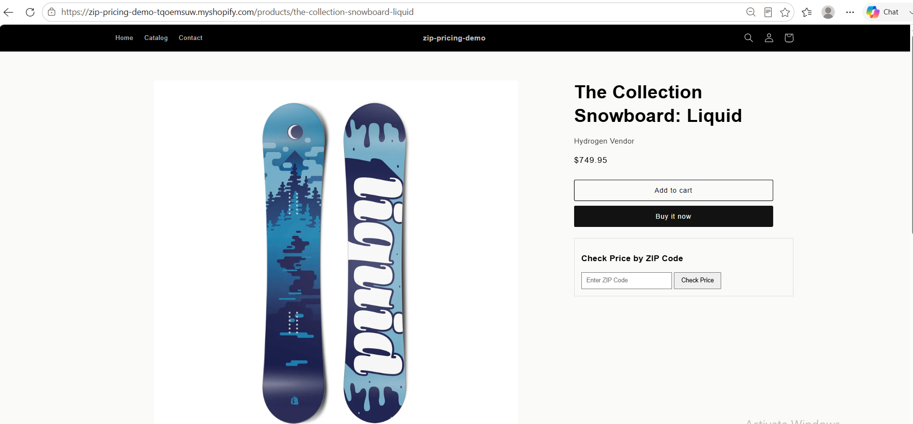
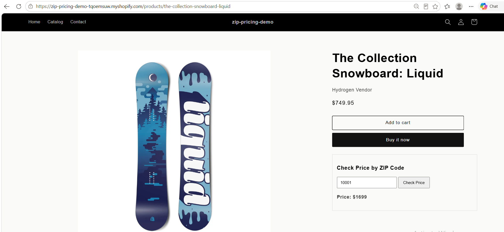
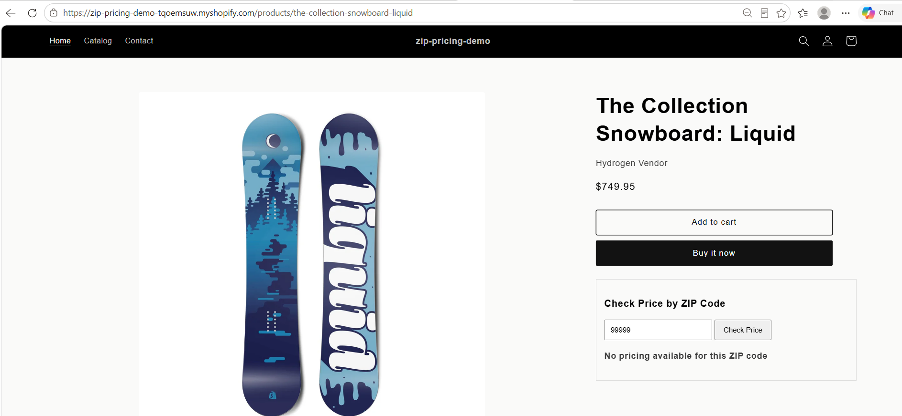
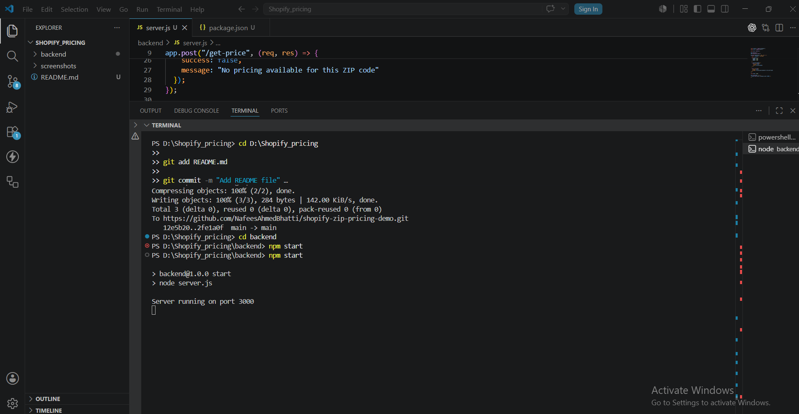

# Shopify ZIP Pricing Demo

A Shopify demo project that provides dynamic product pricing based on customer ZIP codes using a Node.js backend and Shopify App Proxy.

## Features

- Dynamic ZIP code-based pricing
- Shopify product page integration
- Node.js + Express backend
- Shopify App Proxy architecture
- Valid and invalid ZIP code handling
- Render deployment
- GitHub version control

---

## Architecture

```text
Product Page
      ↓
Shopify App Proxy
      ↓
Node.js Backend API
      ↓
ZIP-based Pricing Response
```

---

## Tech Stack

### Frontend
- Shopify Theme (Liquid)
- HTML
- JavaScript

### Backend
- Node.js
- Express.js

### Deployment
- Render

### Version Control
- GitHub

---
## Screenshots

### Home Page


### Product Page



### Valid ZIP Price



### Invalid ZIP Price



### Backend Server


## ZIP Pricing Rules

| ZIP Code | Price |
|-----------|--------|
| 75028 | $1499 |
| 10001 | $1699 |
| 90210 | $1799 |

Invalid ZIP codes return:

```text
No pricing available for this ZIP code
```

---

## API Endpoint

### POST /get-price

#### Request

```json
{
  "zipCode": "75028"
}
```

#### Response

```json
{
  "success": true,
  "price": 1499
}
```

#### Invalid ZIP Response

```json
{
  "success": false,
  "message": "No pricing available for this ZIP code"
}
```

---

## App Proxy Flow

```text
Product Page
↓
/apps/zip-pricing/get-price
↓
Shopify App Proxy
↓
Node.js Backend API
↓
Pricing Response
```

---

## Deployment

### Backend URL

```text
https://shopify-zip-pricing-demo-4apv.onrender.com
```

### Store URL

```text
https://zip-pricing-demo-tqoemsuw.myshopify.com
```

---

## Screenshots

- Home Page
- Product Page
- Valid ZIP Price
- Invalid ZIP Price
- Backend Server

---

## Project Structure

```text
Shopify_pricing/
│
├── backend/
│   ├── package.json
│   ├── package-lock.json
│   ├── server.js
│   └── .gitignore
│
├── screenshots/
│   ├── home-page.PNG
│   ├── product-page.PNG
│   ├── valid-zip-price.PNG
│   ├── invalid-zip-price.PNG
│   └── backend-server.PNG
│
└── README.md
```

---

## Author

**Nafees Ahmed Bhatti**

GitHub: https://github.com/NafeesAhmedBhatti
